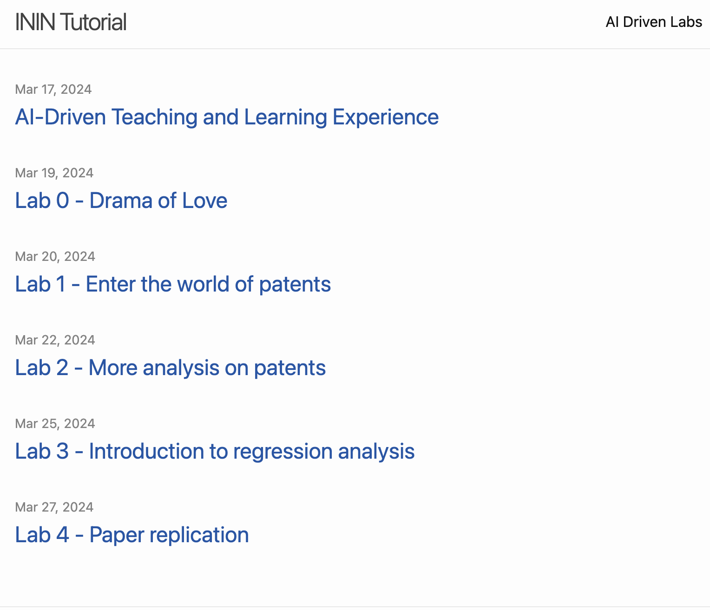
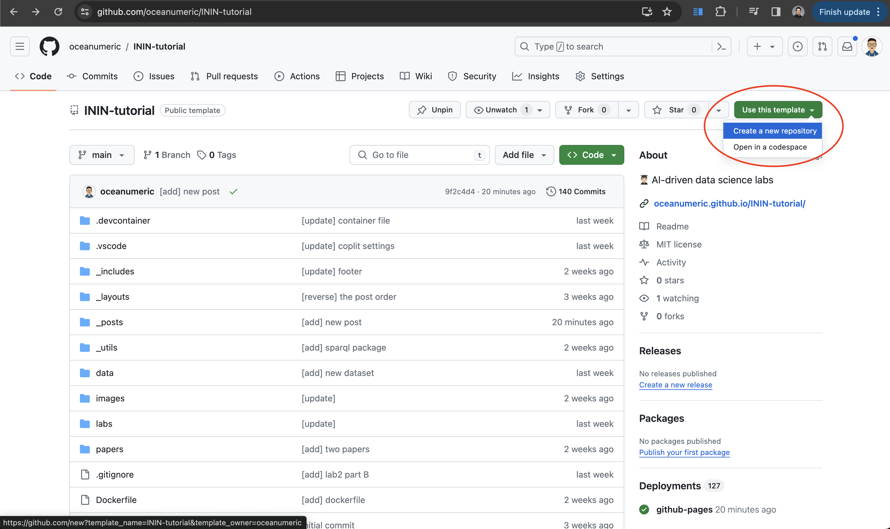

<!-- _class: title -->
# ININ Tutorial Lab Environment Setup

## Fei (Michael) Wang

> ### Economic Department
> Geothe University Frankfurt

## ININ AI-Driven Lab

---

# Roadmap

- ## What to expect from the tutorial
- ## Lab environment setup

---

---

# ININ Tutorial Website

- https://oceanumeric.github.io/ININ-tutorial/

---

---

# Lab Environment Setup

- register a Github account with your university email address: https://github.com/features/copilot
- active Github Copilot: https://github.com/features/copilot
- go to our tutorial repository and click 'use this template' to create your own repository:https://github.com/oceanumeric/ININ-tutorial

---

