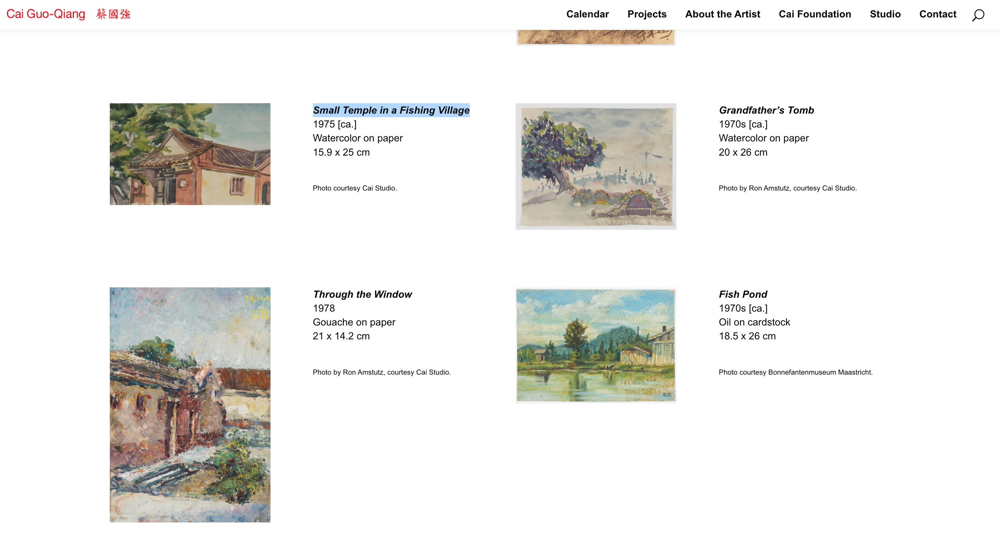

# The ChatGPT Advantage: Leveraging Free Agents for Success


---


# I developed several agents to assist me with my daily work (not like the way you think 🐬)

## Now I'm going to show you how I did it 

> Make your agents be measurable

> It is tricky but everyone can do it too


---


---

# Before we start, let me show you how to set up the above environment

# Lab Session


---

# Roadmap

- Understand how GPTs were trained by doing a simple experiment with [DALL-E](https://labs.openai.com/)

- Try 'Strategic Planning' with ChatGPT

- Try 'Data Extraction Specialist' with ChatGPT
    - Here you will learn what ChatGPTs are really good at
    - You will also learn a secret weapon to make ChatGPTs be more powerful
        - **function calling** ❤️

- Try 'Rank Search Results' with ChatGPT
    - Here you will learn a framework to do prompt engineering _in a scientific way_ 


--- 

# We all know: GPTs are trained with a lot of data

> ~50TB of data


---

# ~50TB of data means what?

- My laptop is 6 years old
    - I used for all kinds of work
- 108GB Documents (not all of them are generated by me)
- 50TB = 50,000GB
    - $50,000 / 108 \approx 463$ people working for 6 years
    - $463 \times 6 \approx 2,778$ years of work by one person


---

# ~50TB of data means what?

- High quality of data collected from the Internet

- Structured data collected from the Internet

> Knowing how they collected the data and what kind of data they collected is important


---

# Cai Guo-Qiang


---

<iframe width="960" height="500" src="https://www.youtube.com/embed/lLTT8ogRf50?si=rZOqpcwcLej34kwx" title="YouTube video player" frameborder="0" allow="accelerometer; autoplay; clipboard-write; encrypted-media; gyroscope; picture-in-picture; web-share" allowfullscreen></iframe>

---




---


Small Temple in a Fishing Village
1975 [ca.]
*Watercolor on paper*
15.9 x 25 cm


---


---


---


---


---

# ~50TB of data means what?

- High quality of data collected from the Internet
    - with very good labels
    - in terms of quality
        - for images - resolution, etc.
        - for text - grammar, etc


---

# ~50TB of data means what?

- High quality of data collected from the Internet
    - with very good labels
    - in terms of quality
        - for images - resolution, etc.
        - for text - grammar, etc
- Structured data collected from the Internet
    - knowledge graph
    - things are mapped to each other
        - images to text
        - problems to solutions
            
            

---


---

# Why knowing this will help us?

- this will help us to know how to feed the data to the GPTs
    - how to prepare the data
    - how to make the data structured
    - how to make the data high quality

- this will also help us to know how to use the GPTs


---

# Let's do a simple experiment with ChatGPT


---

# Strategic Planning

```
# Prompt

You are a master of doing strategic planning.
Your goal is to help your client to get the best plan 
and executable actions to achieve the client's goal 
as well as possible. 

If the client's is goal is not very clear, 
help the client to refine the goal too.
```


---

# Lab Session


--- 

# This kind of strategic planning is still too abstract

- It could guide us some directions
- But, you will not feel that you are being empowered

<br>

> RULE NO.1: Avoide using ChatGPT to answer general questions (or big questions)

<br>

- You can consult with it but don't rely on it


---

# Let's do another experiment with ChatGPT

## Data Extraction Specialist


---

# Data Extraction Specialist

```
You are a Data Extraction Specialist is 
responsible for retrieving specific data points 
from various sources based on user requests. 
You can fetch specific data points from different 
sources as per user requests depending on the specific 
context or industry. 

You are now hired as a helpful assistant for helping you 
clients at HyperGI.
```


--- 

# Lab session


---

# Function Calling (one of the secret weapons)


---

# Function calling

- It is a way to make ChatGPTs be more powerful
    - Very handy for doing data extraction
    - It structures the data very well
    - You need to know `json` format a little bit
        - Do not be scared, it is very easy
        - It is just a nested dictionary

```js
{
    "agent_name": "data_extraction_specialist",  // string
    "creator": "Michael",
    "version": [{"2021-12-01": "v1.0.0"}, {"2021-12-02": "v1.0.1"}]  // array 
}
```


---

# Function calling


```js
{
  "name": "extract_address",
  "parameters": {
    "type": "object",
    "properties": {
      "company_name": {
        "type": "string",
        "description": "The name of company"
      },
      "address": {
        "type": "string",
        "description": "The address of the company"
      },
      "country": {
        "type": "string",
        "description": "The located country of the company"
      }
    },
    "required": [
      "company_name",
      "address",
      "country"
    ]
  },
  "description": "Extract the address from the website"
}
```

---

# Function calling

## Format matters a lot

- Start with the example provided by OpenAI

- Define the structure of the data (whatever you want)

> Remember to save after editing the function calling ⚠️


---


```js
{
  "name": "extract_contacts",
  "parameters": {
    "type": "object",
    "properties": {
      "country_phone_code": {
        "type": "number",
        "description": "The country phone code of the company"
      },
      "email": {
        "type": "string",
        "description": "The email of the company"
      }
    },
    "required": [
      "country_phone_code", "email"
    ]
  },
  "description": "Extract the contact information from the website"
}
```

---

# Why does ChatGPTs love json format?

## Another secret I will share with you now :)


---

# This is not made for children


---

# Lab Session


---

# Welcome to Schema.org


> Founded by Google, Microsoft, Yahoo and Yandex, Schema.org vocabularies are developed by an open community process, using the public-schemaorg@w3.org mailing list and through GitHub.

<br>

- [Person](https://schema.org/Person)
- [Organization](https://schema.org/Organization)
- [Health/medical](https://schema.org/docs/meddocs.html)


---

# ~50TB of data means what?

- High quality of data collected from the Internet
    - with very good labels
    - with very good quality
        - for images - resolution, etc.
        - for text - grammar, etc
- Structured data collected from the Internet

<br>

> Takeaway: json format works very well with ChatGPTs


---

# See How LinkedIn Uses My Data

# Lab Session


---

# Inferences About You 

- `career inference`
    - `people leader`
- `age inference`
    - `25-34`
    - based on your education and experience


--- 

# Will I stop using LinkedIn?

- No, I will not stop using LinkedIn
    - I will use it more often


> The above text is generated by ChatGPT after typing `No`...


--- 

# Will I stop using LinkedIn?

> Society as an interactive process

- The faster information flows, the faster society evolves
    - Trial and error
- Let's iterate faster
    - You give me your data
    - if I used it well, you will be happy
    - if I used it badly, punish me as you wish


---

# Also, there are people who want to share their data, like me 😎


---

# Like her (for educational purpose only)


---

# Anyway, you got the POINT (or POINTS)


---

# Like her 


---

# Let's summarize what we have learned so far

- GPTs are trained with a lot of data

- Knowlge graph as a map between different data

- Avoid using ChatGPT to answer general questions (or big questions)

- Function calling is a secret weapon for extracting information you want

- json format works very well with ChatGPTs

- schema.org is a good place to find the structure of the data


--- 

# You learned a lot today

## One more Lab Session


---

# Rank Search Results

- A relative hard task for ChatGPT

- You will learn a framework to do prompt engineering _in a scientific way_

- You will also learn how to design a `data strategy` for your ChatGPTs


---

# Rank Search Results

## Problem setting

> I notice a company called `watershed`, a software platform to help businesses to reduce their carbon footprint comprehensively. I want to know more about it.


---


---

# I want to find how they did it

## Of course, I googled it

- Selected `30` results from Google
- Each of them is a `json` object


---

```js
{
"date": ["2024-01-16"],
  "query": ["how watershed help firms to reduce carbon emissions"],
  "results": [
        {
        "result_idx": 1,
        "title": "Watershed — The enterprise climate platform",
        "link": "https://watershed.com/",
        "snippet": "Watershed is the enterprise climate platform.
        Measure your carbon footprint, report your results,
        and take action to reduce your emissions — starting now."
        },
        // ... many more results upto 30
    ]
}
```

---

# I want ChatGPT to help me to select the best results that fit my needs

> 🧐 how could ChatGPT know what I want?

> Prompt Engineering 🦾


---

# Lab Session