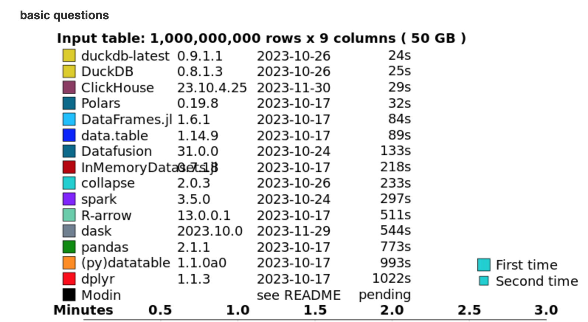

# Zero to Hero: Navigating Data Science for AI Developers

## 10 years of experience in 120 minutes

 

Fei Wang (Michael) :heart: AI and many other things

HyperGI

Github: [oceanumeric](https://github.com/oceanumeric)

---

---

# Not joking

## Training material for my team

---

# My journey

- 2012-2017: Financial Analyst (CFA charterholder)
    - R and Python for data analysis

- 2017-2019: Studying Mathematics and Statistics
    - Mainly using Python

- 2019 - now: Machine Learning Engineer and NLP Researcher
    - Mainly using Python for AI development
    - R and SQL for data analysis

---

# Why we need Data Science for AI development?

- AI is a data-driven technology

- Many AI development tasks are data science tasks
    - cleaning data
    - structuring data
    - analysing data

- It is much cheaper to feed clean data to AI models compared to using dirty data

---

# AI develoment = Data Structure + Algorithm (AI models)

---

# New level of automation

- Traditional software development heavily relies on structured data
    - e.g. relational database
    - e.g. JSON

- AI development requires a new level of automation
    - e.g. unstructured data
    - e.g. images, videos, audios, texts, etc.

---

# New level of automation

- But we still need to structure data for AI development
    - e.g. data cleaning
    - e.g. data augmentation
    - e.g. data labelling

---

# Roadmap

- Benchmarking of `duckdb`, `R-data.table` and `pandas`

- Environment setup

- Big picutre of data science for AI development

- Demos and Labs

- GNU Make for data science

---

# Benchmarking of duckdb, R-data.table and pandas

---

---

<iframe width="700" height="400" src="https://www.youtube.com/embed/Bnejj-I09LA?si=UipU80pdO38ocx3j" title="YouTube video player" frameborder="0" allow="accelerometer; autoplay; clipboard-write; encrypted-media; gyroscope; picture-in-picture; web-share" allowfullscreen></iframe>

---

# Environment setup

- Github account
- Codespaces from Github
- Github Copilot (optional)
    - If you are a student, you can apply for a free Github Pro account

- I assumed you
    - you have a Github account
    - basic knowledge of Python and R
    - Github Education account (optional but recommended)
    - or Github Pro account (optional but recommended)

---

# Big picture of data science for AI development