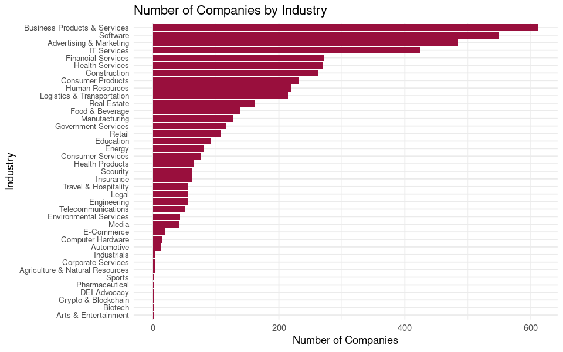

# Zero to Hero: Navigating Data Science for AI Developers

## 10 years of experience in 120 minutes

<br>

Fei Wang (Michael) :heart: AI and many other things

HyperGI

Github: [oceanumeric](https://github.com/oceanumeric)


---


---

# Not joking

## Training material for my team


---

# My journey

- 2012-2017: Financial Analyst (CFA charterholder)
    - R and Python for data analysis

- 2017-2019: Studying Mathematics and Statistics
    - Mainly using Python

- 2019 - now: Machine Learning Engineer and NLP Researcher
    - Mainly using Python for AI development
    - R and SQL for data analysis


---


# Why we need Data Science for AI development?

- AI is a data-driven technology

- Many AI development tasks are data science tasks
    - cleaning data
    - structuring data
    - analysing data

- It is much cheaper to feed clean data to AI models compared to using dirty data


---

# AI develoment = Data Structure + Algorithm (AI models)


---

# New level of automation

- Traditional software development heavily relies on structured data
    - e.g. relational database
    - e.g. JSON

- AI development requires a new level of automation
    - e.g. unstructured data
    - e.g. images, videos, audios, texts, etc.


---

# New level of automation

- But we still need to structure data for AI development
    - e.g. data cleaning
    - e.g. data augmentation
    - e.g. data labelling


---

# Roadmap


- Benchmarking of `duckdb`, `R-data.table` and `pandas`

- Environment setup

- Big picutre of data science for AI development

- Demos and Labs

- GNU Make for data science


---

# Benchmarking of duckdb, R-data.table and pandas


---


---

<iframe width="700" height="400" src="https://www.youtube.com/embed/Bnejj-I09LA?si=UipU80pdO38ocx3j" title="YouTube video player" frameborder="0" allow="accelerometer; autoplay; clipboard-write; encrypted-media; gyroscope; picture-in-picture; web-share" allowfullscreen></iframe>


---

# Environment setup

- Github account
- Codespaces from Github
- Github Copilot (optional)
    - If you are a student, you can apply for a free Github Pro account

- I assumed you
    - you have a Github account
    - basic knowledge of Python and R
    - Github Education account (optional but recommended)
    - or Github Pro account (optional but recommended)


---

# Big picture of data science for AI development

## mini-videos are made by `manim` and `Copilot`


---

# R-data.table syntax


<div class="columns">
<div>

## data[i, j, by]

```r
DT[3:4,]
DT[3:4] # same

# negative index
DT[!3:7,]
DT[-(3:7)] # same

DT[V4 %like% "^B"]
```

</div>
<div>

## pandas

```python
# index location based (iloc)
DF.iloc[2:4]


# negative index
DF[~DF.index.isin(range(2, 7))]

DF[DF.V4.str.startswith('B')] 
```
</div>
</div>

[source](https://atrebas.github.io/post/2020-06-14-datatable-pandas/)


---

# R-data.table syntax

<div class="columns">
<div>

## data[i, j, by]

```r
# j for selecting columns

DT[, .(V1, V2)] 

# group by V3
DT[, .(V1, V2), by = V3] 

# group by V3 and V4
DT[, .(V1, V2), by = .(V3, V4)] 
```
</div>
<div>

## pandas

```python

# using [[]] for selecting columns

DF[['V1', 'V2']]

# group by V3
DF.groupby('V3')[['V1', 'V2']] 

# group by V3 and V4
DF.groupby(['V3', 'V4'])[['V1', 'V2']] 
```
</div>
</div>


---

# R-data.table syntax


## data[i, j, by]

```js
data %>%
    .[, .(sale_sum=sum(sales)), by=region] %>%
    .[sale_sum > 1000000] %>%
    .[order(-sales)]
```

---

## pandas

```python
(df
    .groupby('region')
    .agg({'sales': 'sum'})
    .reset_index()
    .query('sales > 1000000')
    .reset_index(drop=True)
)
```


---

# Let's Practice Together


---

# Code Snippets

```r
inc5000 <- jsonlite::fromJSON('data/inc5000_2023.json')

str(inc5000)

names(inc5000)

str(inc5000$listInfo)

str(inc5000$companies)
```


---

# Code Snippets

```R
# dollar sign $ is to access the variable inside the data frame
inc5000$companies %>% 
    # convert to data.table
    as.data.table() %>%
    # column names
    names() %>%
    # print out as a table
    kable()
```

```
|x                             |
|:-----------------------------|
|inc5000companyId              |
|inc5000yearId                 |
|rank                          |
|featured_image                |
|company                       |
|...                           |
```

---

# Code Snippets

```r
inc5000$companies %>%
    # convert to data.table
    as.data.table() %>%
    # number of NA in each column
    .[, lapply(.SD, function(x) sum(is.na(x))/.N), .SDcols = names(.)] %>%
    # transpose
    transpose(keep.names = 'variable') %>%
    .[V1 >= 0.9] %>%
    .[, variable] -> na_cols
```


---

# Code Snippets

```r
options(repr.plot.width = 8, repr.plot.height = 5)
inc5000$companies %>% 
    # convert to data.table
    as.data.table() %>%
    .[, !..na_cols] %>%
    # .N means number of rows
    .[, .N, by = industry] %>%
    .[order(-N)] %>%
    # visualize it (the following code was generated by copilot)
    ggplot(aes(x = reorder(industry, N), y = N)) +
    geom_col(fill = ft_palette[1]) +
    coord_flip() +
    labs(x = 'Industry', y = 'Number of Companies',
         title = 'Number of Companies by Industry') +
    theme_minimal() +
    theme(axis.text.y = element_text(size = 8))
```

---

