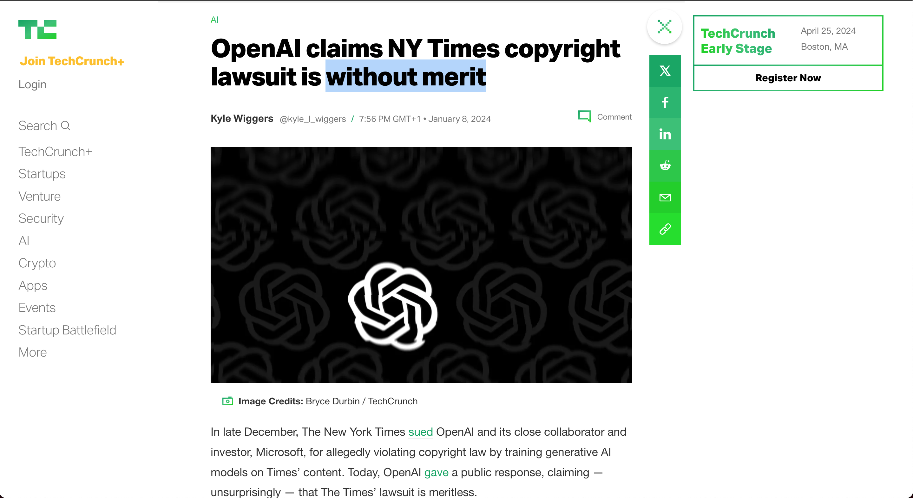
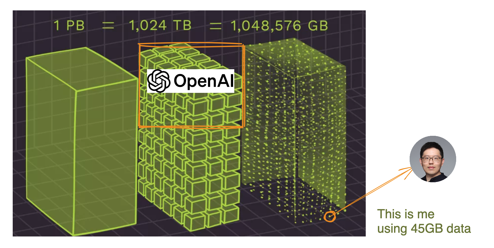
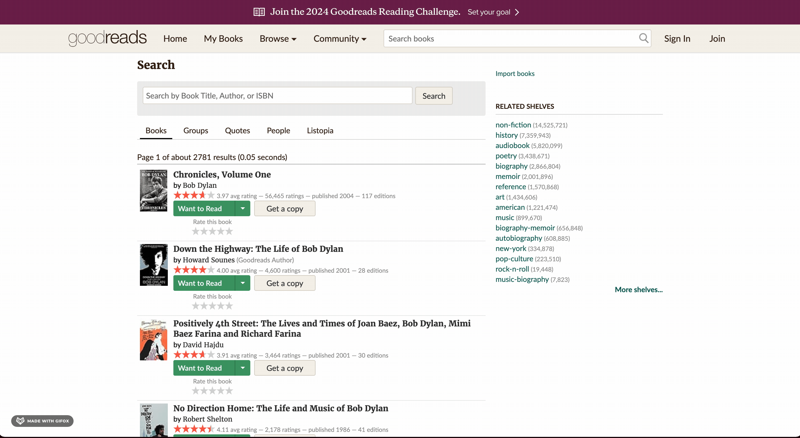
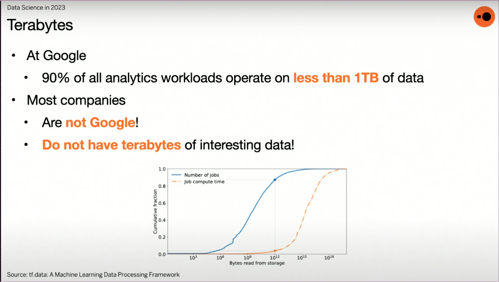
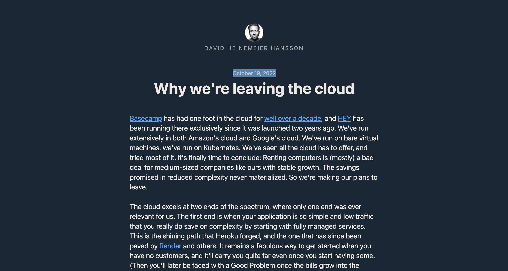
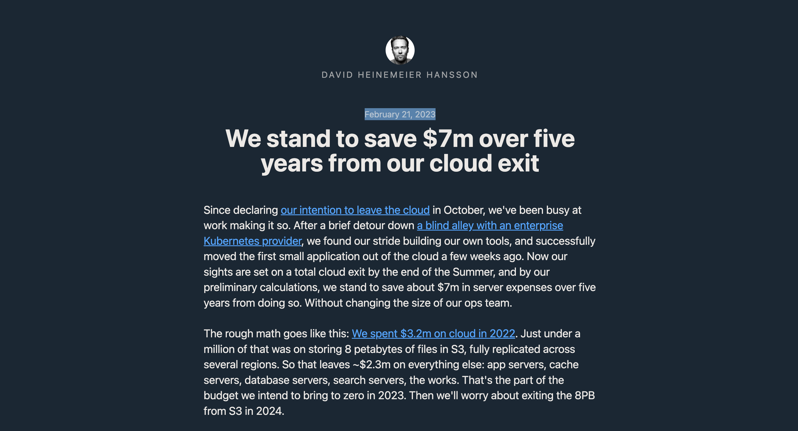
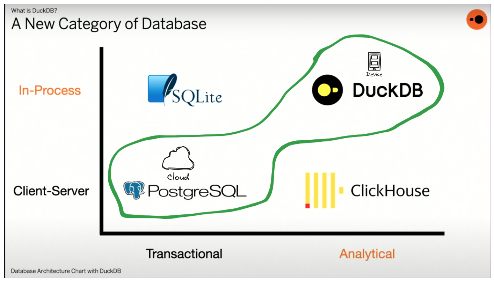

# 180 Secons to AI and DuckDB 
# Why you should care?

Fei Wang (Michael) :heart: AI

HyperGI

Github: [oceanumeric](https://github.com/oceanumeric)


---


---


---



---


---

# It's all about DATA :boom:

# GPT3 - around 45TB of text data


---


---


---


---


---

# Let's have a look at the hardware

<iframe width="700" height="400" src="https://www.youtube.com/embed/Rk3nTUfRZmo?si=w1JBKjOqOGLre52Q&amp;start=264" title="YouTube video player" frameborder="0" allow="accelerometer; autoplay; clipboard-write; encrypted-media; gyroscope; picture-in-picture; web-share" allowfullscreen></iframe>


---


---

# Why only ChatGPT is in production?

- I have tested several products, such as
    - Google `Bard`
    - Meta `Llama`

- BUT, I have to see that ChatGPT is STILL the best one so far 🦄


---

# Ever Since ChatGPT was released


---

# Ever Since ChatGPT was released

## well, you know the story :rocket:


---

# Why it is so hard to build a functional AI product?

## Let's say I want to build a `mini` ChatGPT

- Instead of using 45TB of data, I will use 45GB of data
- Instead of gathering all text everwhere, I will only use the text from `Goodreads`


---




---


# My hardware

```
Architecture:                    x86_64
CPU op-mode(s):                  32-bit, 64-bit
Byte Order:                      Little Endian
Address sizes:                   48 bits physical, 48 bits virtual
CPU(s):                          32
RAM:                             32GB
Disk:                            500GB
GPU:                             2x NVIDIA GeForce RTX 2080 (24GB)
```


---

# To build a mini ChatGPT

- Collect 45GB of data from Goodreads


---

# To build a mini ChatGPT

- Collect 45GB of data from Goodreads
- Clean and Process the data


---

# To build a mini ChatGPT

- Collect 45GB of data from Goodreads 
- Clean and Process the data
- Train the model
- Test the model
- Deploy the model
- Maintain the model


---

# To build a mini ChatGPT

- Collect 45GB of data from Goodreads ✅
- Clean and Process the data
- Train the model
- Test the model
- Deploy the model
- Maintain the model


---



---

# Book dataset

- 2.36M books
- 29 columns, such as author, title, description, etc.


```bash
┌──────────────────────┬────────────────────────────────────────────┬──────┬──────┬─────────┬───────┐
│     column_name      │                column_type                 │ null │ key  │ default │ extra │
├──────────────────────┼────────────────────────────────────────────┼──────┼──────┼─────────┼───────┤
│         isbn         │                  VARCHAR                   │ YES  │ None │   None  │  None │
│  text_reviews_count  │                  VARCHAR                   │ YES  │ None │   None  │  None │
│     country_code     │                  VARCHAR                   │ YES  │ None │   None  │  None │
│    language_code     │                  VARCHAR                   │ YES  │ None │   None  │  None │
│   popular_shelves    │   STRUCT(count BIGINT, "name" VARCHAR)[]   │ YES  │ None │   None  │  None │
│      ........        │                     ...                    │ ...  │ ...  │   ...   │  ...  │
│         asin         │                  VARCHAR                   │ YES  │ None │   None  │  None │
│         url          │                  VARCHAR                   │ YES  │ None │   None  │  None │
│       book_id        │                   BIGINT                   │ YES  │ None │   None  │  None │
│    ratings_count     │                  VARCHAR                   │ YES  │ None │   None  │  None │
│       work_id        │                  VARCHAR                   │ YES  │ None │   None  │  None │
│        title         │                  VARCHAR                   │ YES  │ None │   None  │  None │
└──────────────────────┴────────────────────────────────────────────┴──────┴──────┴─────────┴───────┘
```


--- 

# Reviews dataset

- 15.7m reviews
- 11 columns, such as book_id, user_id, review_text, etc.

```bash
┌──────────────┬─────────────┬──────┬──────┬─────────┬───────┐
│ column_name  │ column_type │ null │ key  │ default │ extra │
├──────────────┼─────────────┼──────┼──────┼─────────┼───────┤
│   user_id    │     UUID    │ YES  │ None │   None  │  None │
│   book_id    │    BIGINT   │ YES  │ None │   None  │  None │
│  review_id   │     UUID    │ YES  │ None │   None  │  None │
│    rating    │    BIGINT   │ YES  │ None │   None  │  None │
│ review_text  │   VARCHAR   │ YES  │ None │   None  │  None │
│  date_added  │   VARCHAR   │ YES  │ None │   None  │  None │
│ date_updated │   VARCHAR   │ YES  │ None │   None  │  None │
│   read_at    │   VARCHAR   │ YES  │ None │   None  │  None │
│  started_at  │   VARCHAR   │ YES  │ None │   None  │  None │
│   n_votes    │    BIGINT   │ YES  │ None │   None  │  None │
│  n_comments  │    BIGINT   │ YES  │ None │   None  │  None │
└──────────────┴─────────────┴──────┴──────┴─────────┴───────┘
```


---

# Let's read in the data


```python
import os
import time
import duckdb
import pandas as pd
from dotenv import load_dotenv
from memory_profiler import profile

if __name__ == "__main__":
    start = time.time() 
    df = pd.read_json("./data/goodreads_books.json.gz", lines=True)
    end = time.time()
    print(end - start)  # computer crashed 💥
    # WARNING: do not use pandas to read a large json file
```

--- 


---

.png)


---

# Still $500 dollars

## not for me :no_good:


---

# Then, I found DuckDB :duck:


---


---

# Let's read in the data again

```python
@profile
def read_json():
    start = time.time()
    duckdb.read_json("./data/goodreads_books.json.gz").show()
    end = time.time()
    print(end - start)  

if __name__ == "__main__":
    read_json()  # 6 seconds for around 8GB data (1.94 GB compressed)
```

<br>

```sql
-- # read and describe books data
DESCRIBE
SELECT * FROM read_json_auto('data/goodreads_books.json.gz')
```

---

# 6 seconds for around 8GB data (1.94 GB compressed)


---

# Benchmark :duck:

```bash
$ python duckdb_profile.py
6.171117067337036
Filename: /home/michael/Github/semantic-search/goodreads/duckdb_profile.py
Line #    Mem usage    Increment  Occurrences   Line Contents
=============================================================
    14    106.7 MiB    106.7 MiB           1   @profile
    15                                         def read_json():
    16    106.7 MiB      0.0 MiB           1       start = time.time()
    17   1231.2 MiB   1124.5 MiB           1       duckdb.read_json("./data/goodreads_books.json.gz").show()
    18   1231.2 MiB      0.0 MiB           1       end = time.time()
    19   1231.2 MiB      0.0 MiB           1       print(end - start)  # 6 seconds 
```


---


---

# DuckDB can process upto 300GB of data

## Way more than enough for my mini ChatGPT

-- with my hardware

- with my money

- finally, I can build my mini ChatGPT :rocket:


---

# Top 10 books with most reviews

```
┌─────────────────────────────────────────┬──────────────────┬────────────────┬──────────┐
│                  title                  │ num_book_reviews │ average_rating │ book_id  │
├─────────────────────────────────────────┼──────────────────┼────────────────┼──────────┤
│          The Fault in Our Stars         │      20756       │      4.26      │ 11870085 │
│ The Hunger Games (The Hunger Games, #1) │      18617       │      4.34      │ 2767052  │
│    Mockingjay (The Hunger Games, #3)    │      13536       │      4.03      │ 7260188  │
│          The Girl on the Train          │      13402       │      3.88      │ 22557272 │
│   Catching Fire (The Hunger Games, #2)  │      11904       │      4.30      │ 6148028  │
│              The Book Thief             │      11300       │      4.36      │  19063   │
│ Fifty Shades of Grey (Fifty Shades, #1) │      11184       │      3.66      │ 10818853 │
│        Divergent (Divergent, #1)        │      10743       │      4.23      │ 13335037 │
│         Twilight (Twilight, #1)         │      10535       │      3.57      │  41865   │
│               The Martian               │       9590       │      4.39      │ 18007564 │
└─────────────────────────────────────────┴──────────────────┴────────────────┴──────────┘
```


---

# Top 10 books with most reviews

```
┌─────────────────────────────────────────┬──────────────────┬────────────────┬──────────┐
│                  title                  │ num_book_reviews │ average_rating │ book_id  │
├─────────────────────────────────────────┼──────────────────┼────────────────┼──────────┤
│                                         │      20756       │      4.26      │ 11870085 │
│                                         │      18617       │      4.34      │ 2767052  │
│                                         │      13536       │      4.03      │ 7260188  │
│                                         │      13402       │      3.88      │ 22557272 │
│                                         │      11904       │      4.30      │ 6148028  │
│                                         │      11300       │      4.36      │  19063   │
│ Fifty Shades of Grey (Fifty Shades, #1) │      11184       │      3.66      │ 10818853 │
│                                         │      10743       │      4.23      │ 13335037 │
│                                         │      10535       │      3.57      │  41865   │
│                                         │       9590       │      4.39      │ 18007564 │
└─────────────────────────────────────────┴──────────────────┴────────────────┴──────────┘
```


---


--- 

# Why you should care?

## It will save you a lot of time and money


---





---


---





---




---




---

# This is how I love DuckDB :duck: now


---

# References

- [DuckDB: Supercharging Your Data Crunching by Richard Wesley](https://youtu.be/3EcOJMDKB7Q?si=3LkaQubDxnhdENHh)
- [Lifewire](https://www.lifewire.com/terabytes-gigabytes-amp-petabytes-how-big-are-they-4125169)
- [David Hansson](https://world.hey.com/dhh/why-we-re-leaving-the-cloud-654b47e0)
- [David Niel](https://www.linkedin.com/posts/davidneal_im-excited-to-announce-ive-joined-motherduck-activity-7107468684226379776-mcmq/)
- MetaBGallStudio
- OpenAI
- New York Times
- TechCrunch
- [DuckDB](https://duckdb.org/)


---

# Happy Coding :rocket:


---

