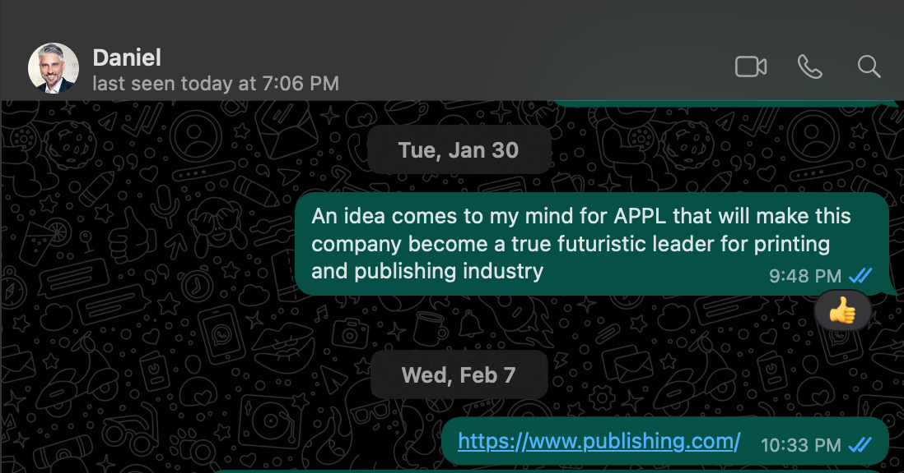
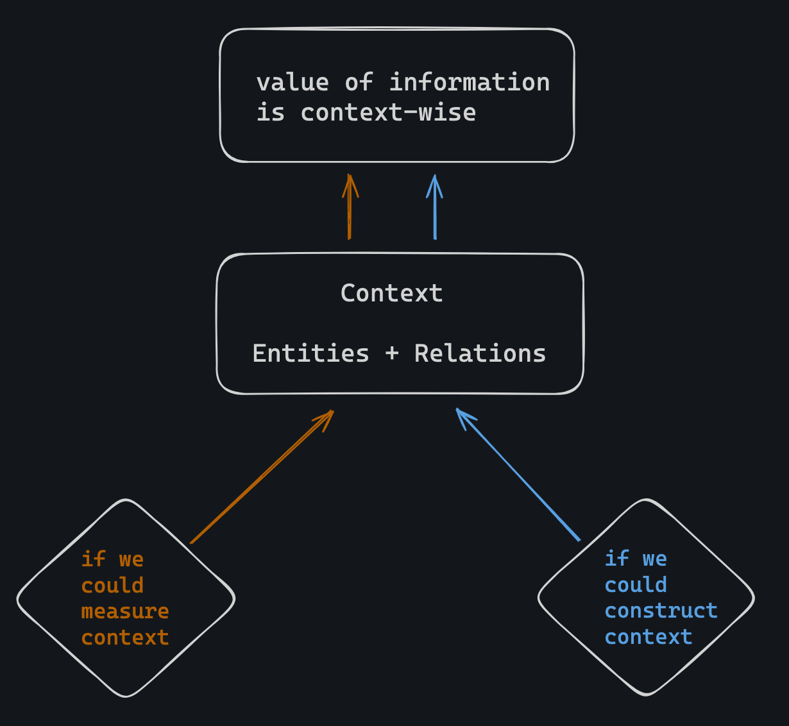
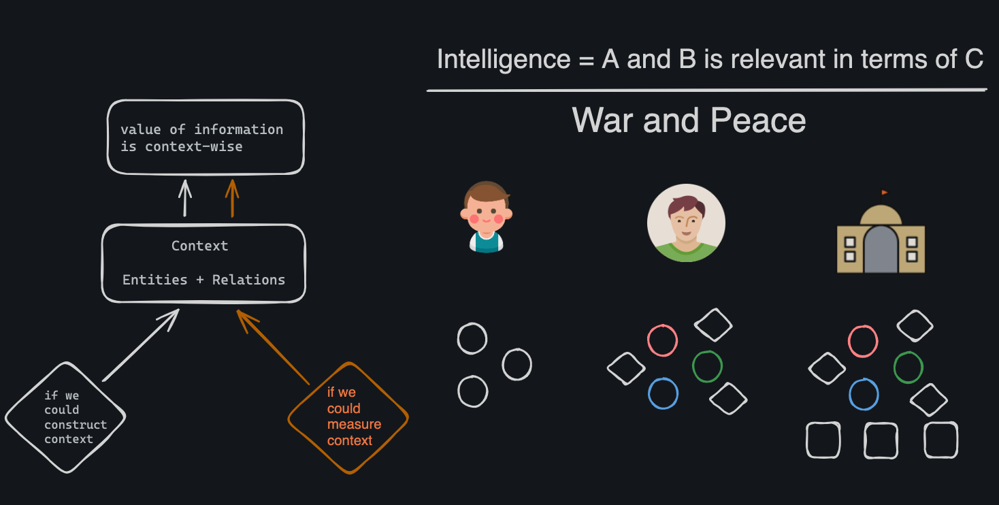
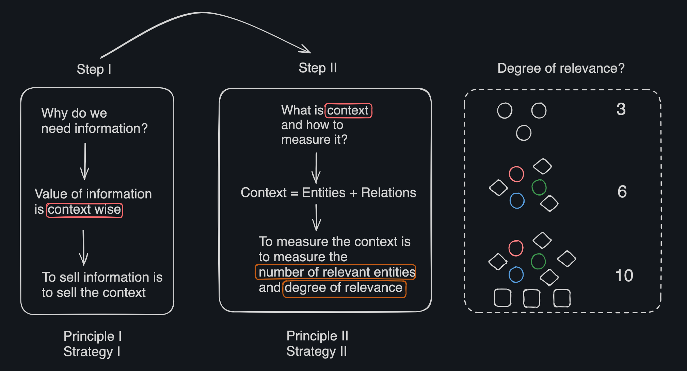
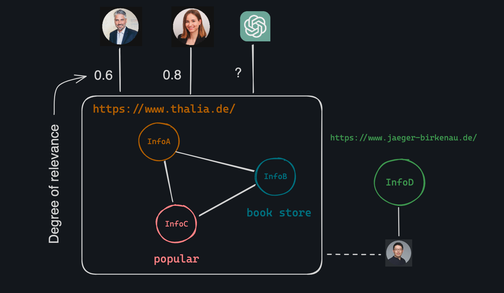
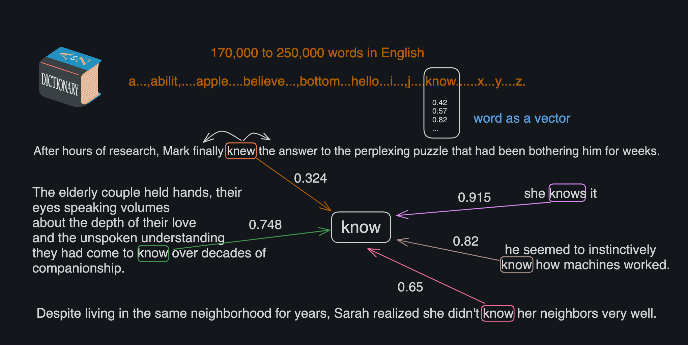
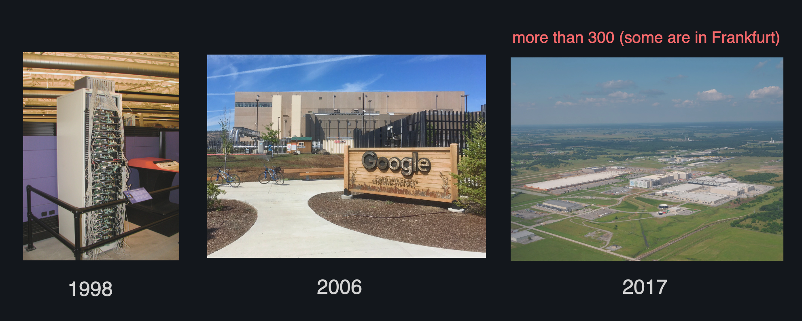

# From the Value of Information to the Value of AI

## Data and AI Strategy at HyperGI

<br>

Fei Wang (Michael) :heart: AI and many other things

HyperGI

Github: [oceanumeric](https://github.com/oceanumeric)


---

# Roadmap

- 26 January: Encountered a problem

---

# Roadmap

- 29 January


---

# Roadmap

- 30 January: had a blur idea about it (...)




---

# Roadmap

- 09 February: had a talk with Christian (explained and further developed the idea)


---

# Q1 - Why do we need information?

- Human beings are information-driven animals
    - our brain is a complex information processing system
    - we reply on information to make decisions
    - we are curious about the world

<br>

> In the business world, many important decisions are made based on information.


---

# Q2 - Is it always beneficial to have more information?

- tricky? 🧐
- what is the value of the information?
- What is the cost of getting the information?


<br>

> Both the value and the cost of information are context-dependent.


---

# Q2 - Examples

- It will rain tomorrow ⛈
    - Cost: almost zero
    - Value: depends
        - for airline industry: high
        - for a homeoffice worker: low

- In the war, the enemy is going to attack tomorrow
    - Cost: high
    - Value: high


--- 

# Principle I: The value of information is context wise


---

# Strategy I: To sell information is to construct (or sell) context


---

# Some examples

<iframe width="960" height="500" src="https://www.youtube.com/embed/8Nvf4BteCR4?si=5rEMXSFqnYbFP2JS&amp;start=269" title="YouTube video player" frameborder="0" allow="accelerometer; autoplay; clipboard-write; encrypted-media; gyroscope; picture-in-picture; web-share" allowfullscreen></iframe>


---

# Q3 - What is context and how to measure it?

- Context is the background information that is needed to interpret the information
    - what is the background information?
    - Can AI understand the context?

<br>


---

# Can AI understand the context?

## Yes

- The following example shows that AI can understand the context

<br>

```
> Here is a job title: data scientist, give me a short-bio that
could be used for a resume

ChatGPT: A dedicated and results-oriented data scientist
with [X years] of experience in leveraging advanced
analytics techniques to extract insights and
drive strategic decision-making.
Proficient in statistical analysis, ....
```


---

# Can AI understand the context?

## Yes or No

<br>


---

# Can AI understand the context?

## Yes or No

<br>

```
> Do you know this website: https://www.thalia.de/,

ChatGPT: Yes, I'm familiar with Thalia.de. Thalia is a
German-based chain of bookstores and online retailer
specializing in books, e-books, music, movies, and more.
Thalia.de offers a wide range
```


---

# Can AI understand the context?

## Yes or No


<br>

```
> Do you know this website: https://www.jaeger-birkenau.de/

ChatGPT: I'm sorry, but I couldn't find any information
on "https://www.jaeger-birkenau.de/".
It seems to be a specific website, but without 
more context, I can't provide details about its content or purpose.
```


---

# What is the context?

- Context is just linked information
    - ChatGPT knows Thalia.de because
        - first, it is in its training data (database)
        - second, it is linked to other information (such as bookstores, online retailer, books, e-books, music, movies, etc.)
    - I didn't know the Thalia.de because
        - I did not store this information in my brain

- Therefore, we can say that

> Context = Entitites + Relations


---

# Principle II: Context is linked information (Entitites + Relations)


---

# Why context matters?

- Context is the key to understand the information
    - without context, information is meaningless
    - with context, information is valuable


---

# Recap

- Principle I: The value of information is context-wise
- Strategy I: To sell information is to construct (or sell) context
- Principle II: Context is linked information (Entitites + Relations)

<br>

> How could we measure the context? Why it matters?


---




---

# How to measure the context?

- Tomorrow is going to rain
    - Context: weather, location, time, etc.
    - Context in the airline industry: very valuable
        - very relevant to the business
    - Context in the homeoffice worker: not valuable
        - not relevant


---

# How to measure the context?
  
- Context in the airline industry: very valuable

> Context is rich; ✈️⛑👨‍👩‍👦💸...

- Context in the homeoffice worker: not valuable

> Context is not that rich; 🏡👨‍💻🪑


---





---

# Strategy II: To measure the context is to measure the number of relevant entities and degree of relevance (relations)


[ChatGPT's Answer](https://chat.openai.com/share/a3f1b0b1-48f9-4ba4-a5c6-6ac22eb84a50)


---

# Recap

- Principle I: The value of information is context-wise
- Strategy I: To sell information is to construct (or sell) context
- Principle II: Context is linked information (Entitites + Relations)
- Strategy II: To measure the context is to measure the number of relevant entities and degree of relevance (relations)


---




---

# How does ChatGPT (LLM) understand the context?

- Entities (easy, just store the information in the database)
- Relations (hard, need to learn from the data)


---

# How to measure the degree of relevance?

- we can assign a score (or weight) to each relation
    - the higher the score, the more relevant the relation is
    - the lower the score, the less relevant the relation is


---




---




---

# Bill Gates and Sam Altman

<iframe width="960" height="500" src="https://www.youtube.com/embed/8-Ymdc6EdKw?si=14eQukFU90KTAiM5&amp;start=35" title="YouTube video player" frameborder="0" allow="accelerometer; autoplay; clipboard-write; encrypted-media; gyroscope; picture-in-picture; web-share" allowfullscreen></iframe>


---

# Greg Brockman Today

<iframe width="960" height="500" src="https://www.youtube.com/embed/Rp3A5q9L_bg?si=jisfi0Vxj-52Yzad&amp;start=1992" title="YouTube video player" frameborder="0" allow="accelerometer; autoplay; clipboard-write; encrypted-media; gyroscope; picture-in-picture; web-share" allowfullscreen></iframe>


---

# Greg Brockman (6 years ago)

<iframe width="560" height="315" src="https://www.youtube.com/embed/UdIPveR__jw?si=GV2M_S1yxoI5McSx&amp;start=1992" title="YouTube video player" frameborder="0" allow="accelerometer; autoplay; clipboard-write; encrypted-media; gyroscope; picture-in-picture; web-share" allowfullscreen></iframe>

---


---

# Human vs AI (complementary to each other)


| | Human | AI |
|---|---|---|
|context | we understand the context | AI understands the context _partially_ |
| memory | strore information in the brain | store information in the database |
| reasoning | intuition and logic | algorithms |
| shortcoming | limited memory and processing power | limited understanding of the context |
| advantage | creativity and flexibility | scalability and efficiency |

---

# Prince III: In the information and AI age, graph or neural network is the key to understand the context


---

# Strategy III: To measure or construct the context is to measure or construct the graph or neural network (nodes, edges, and weights)

---

# Recap

- Principle I: The value of information is context-wise
- Strategy I: To sell information is to construct (or sell) context
- Principle II: Context is linked information (Entitites + Relations)
- Strategy II: To measure the context is to measure the number of relevant entities and degree of relevance (relations)
- Prince III: In the information and AI age, graph or neural network is the key to understand the context
- Strategy III: To measure or construct the context is to measure or construct the graph or neural network (nodes, edges, and weights)


---

# Concrete examples


- Problem: how could I measure the degree of relevance for any entity and relation?

    - `www.thalia.de` (saved in the database by ChatGPT)
    - `www.jaeger-birkenau.de` (not saved in the database by ChatGPT)


---

# How to solve the problem? First attempt

- [Builtwith](https://trends.builtwith.com/websitelist/Shopify/Germany)
- [Similarweb](https://www.similarweb.com/de/website/thalia.de/)
- [Similarweb-lP](https://lp.similarweb.com/)

<br>

> Too Expensive
> Why they could charge such a high price?


---


---


# How to solve the problem?

## Use our principles and strategies

<br>

> I need to construct the context (graph or neural network) for each entity and relation


---

# Which company stores the largest number of entities and relations?

- Google (search engine, knowledge graph, and youtube)
- Meta (Facebook, Instagram, and WhatsApp)
- Amazon (e-commerce)
- Microsoft (Bing, LinkedIn, and GitHub)
- OpenAI (ChatGPT, Codex, and DALL-E)
- ...


---

# Google Data Center

<iframe width="960" height="500" src="https://www.youtube.com/embed/XZmGGAbHqa0?si=USW1rmiRHAcLSGrW" title="YouTube video player" frameborder="0" allow="accelerometer; autoplay; clipboard-write; encrypted-media; gyroscope; picture-in-picture; web-share" allowfullscreen></iframe>


---




---

# How to construct the context with Google?

```
> Generate a list of schemes for the furniture industry
{'schemes': ['Product/Service Types',
             'Business Types',
             'Attributes or Qualities',
             'Functionality or Purpose',
             'Geographical Factors',
             'Culture Factors',
             'Customer Experience',
             'Market Presence or Influence',
             'Technological Aspects',
             'Regulatory or Compliance Factors',
             'Material Composition',
             'Top Brands or Companies',
             'Cost or Pricing',
             'Maintenance and Service',
             'Design Styles',
             'Customization Options',
             'Sustainability Features',
             'Assembly Requirements',
             'Warranty and Support',
             'Supply Chain Transparency']}
```

---

# How to construct the context with Google?

```
> Industry is: furniture; scheme: [Attributes or Qualities]
'vocabularies': ['Durability',
                  'Comfort',
                  'Design',
                  'Functionality',
                  'Quality',
                  'Materials',
                  'Style',
                  ....
                  'Craftsmanship',
                  'Elegance',
                  'Finish',
                  'Aesthetics',
                  'Innovation',
                  'Customization',
                  'Eco-Friendly',
                  'Versatility',
                  'Affordability',
                  'Luxury'
]
```

---

# Many interesting things happened 🍄🚀🧐💸📌


---

# Many interesting things happened 🍄🚀🧐💸📌

- 81,892 results searched in 2-3 hours
- cost: 46.78 Euro
- Google Price: 5 Euro (or dollars) per 1000 searches

|user_search_taxonomy     | average_search_results|
|:------------------------|----------------------:|
|Top Brand                |              217333563|
|Customer Experience      |              173123299|
|Attributes or Qualities  |              112473769|
|Functionality or Purpose |              109781259|
|Product/Service Types    |               86085654|


--- 

|user_search_taxonomy         |search_query                             | average_search_results|
|:----------------------------|:----------------------------------------|----------------------:|
|Functionality or Purpose     |Design + site:instagram.com + Möbel      |              239000000|
|Market Presence or Influence |Möbeldesign + site:instagram.com + Möbel |              232000000|
|Functionality or Purpose     |Entwurf + site:instagram.com + Möbel     |              231000000|
|Attributes or Qualities      |Ästhetik + site:instagram.com + Möbel    |              213000000|
|Business Types               |Möbeldesign + site:instagram.com + Möbel |              209000000|
|Attributes or Qualities      |Design + site:instagram.com + Möbel      |              192000000|
|Attributes or Qualities      |Stil + site:instagram.com + Möbel        |              178000000|
|Culture Factors              |Ästhetik + site:instagram.com + Möbel    |              173000000|
|Attributes or Qualities      |Komfort + site:instagram.com + Möbel     |              163000000|
|Functionality or Purpose     |Komfort + site:instagram.com + Möbel     |              163000000|


---

# Many interesting things happened 🍄🚀🧐💸📌

|domain                        |   N|
|:-----------------------------|---:|
|https://www.amazon.de/        | 297|
|https://www.otto.de/          | 256|
|https://www.linkedin.com/     | 242|
|https://www.instagram.com/    | 238|
|https://www.ikea.com/         | 218|
|https://www.facebook.com/     | 205|
|https://www.moebel-martin.de/ | 178|
|https://www.pinterest.com/    | 177|
|https://www.inhofer.de/       | 172|
|https://moebel-boss.de/       | 158|


---

# Many interesting things happened 🍄🚀🧐💸📌

|domain                          |  N|
|:-------------------------------|--:|
|https://www.knutzen.de/         | 16|
|https://moebelmay.de/           | 11|
|https://www.ggmmoebel.com/      | 19|
|https://www.haefele.de/         | 11|
|https://vanguardfurniture.com/  | 12|
|https://www.jaeger-birkenau.de/ | 17|
|https://www.moebel-grieger.de/  | 12|
|https://www.service-check.com/  | 15|
|https://www.degruyter.com/      | 16|
|https://www.hiller-moebel.de/   | 12|


---

# Many interesting things happened 🍄🚀🧐💸📌

- More than 14K Instagram accounts were found


---


---

<iframe width="960" height="500" src="https://www.youtube.com/embed/uHBFMK6h4Mc?si=pxyy-KVQaBLPa_iy&amp;start=432" title="YouTube video player" frameborder="0" allow="accelerometer; autoplay; clipboard-write; encrypted-media; gyroscope; picture-in-picture; web-share" allowfullscreen></iframe>