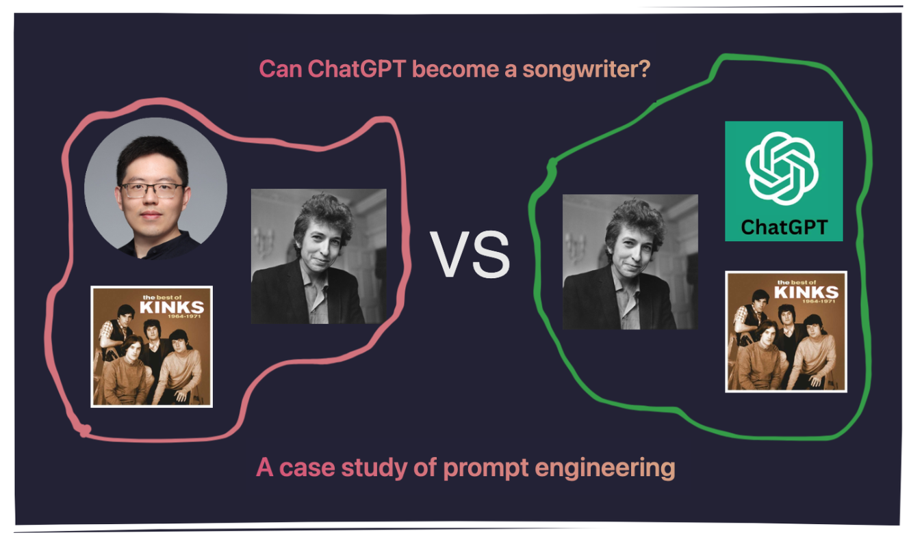
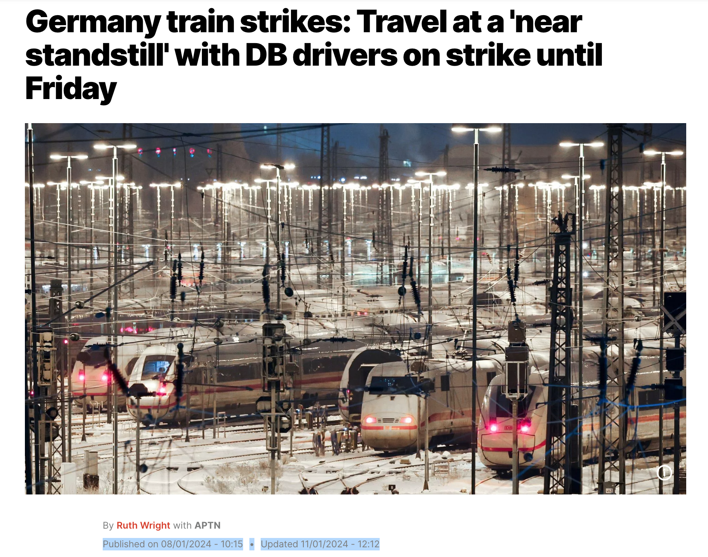
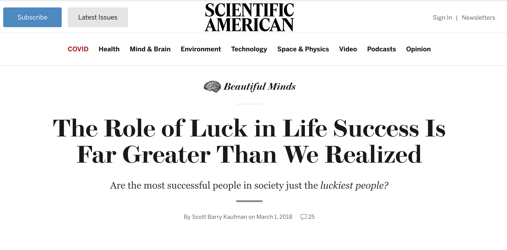
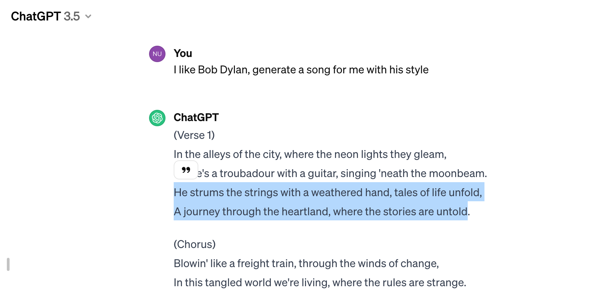
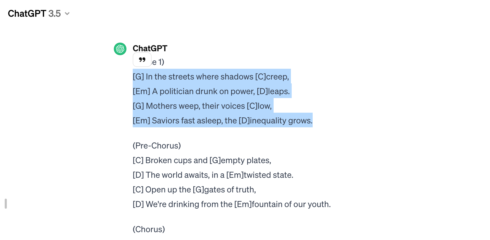
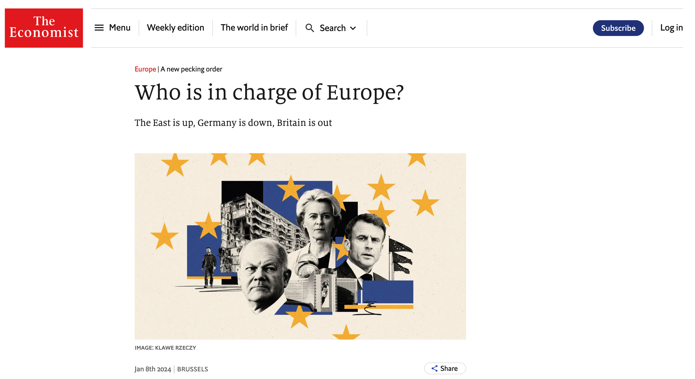
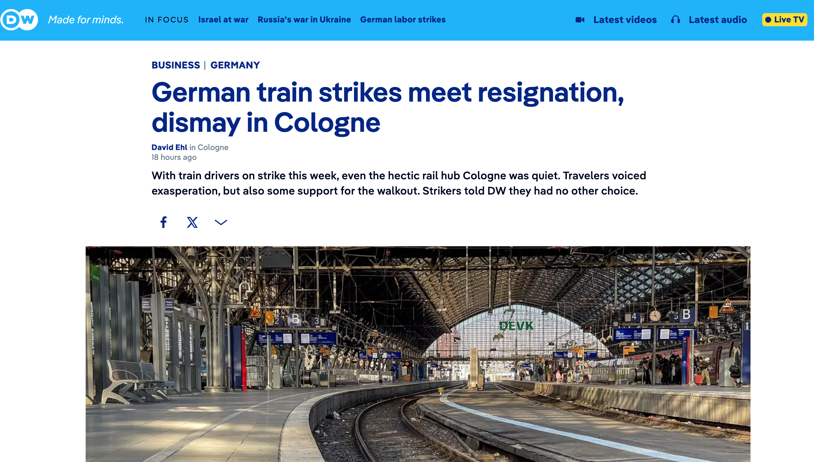
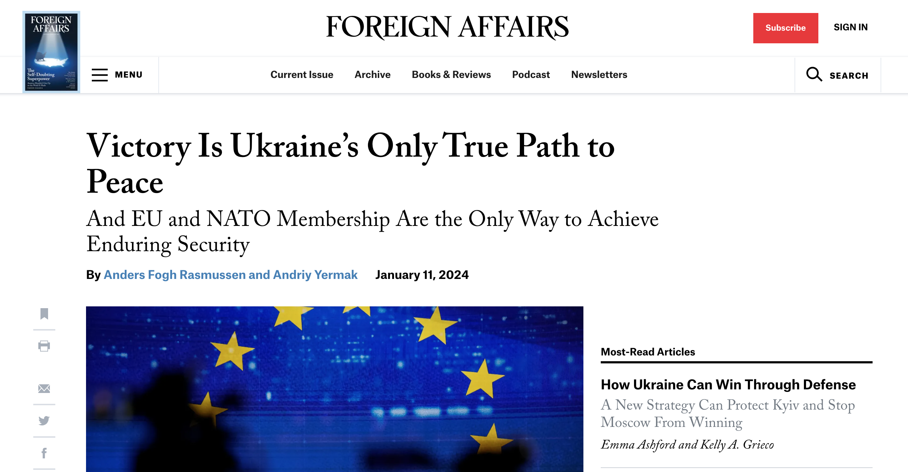

---


# Roadmap

- Listen to a song that I wrote


---


# Roadmap

- Listen to a song that I wrote

- Explain how I wrote it


---


# Roadmap

- Listen to a song that I wrote

- Explain how I wrote it

- Based on the same information and situiation
    - do prompt engineering to write a new song with ChatGPT
    - compare the two songs


---


# Roadmap

- Listen to a song that I wrote

- Explain how I wrote it

- Based on the same information and situiation
    - do prompt engineering to write a new song with ChatGPT
    - compare the two songs
    - learn what is prompt engineering 
        - such as 'Few-shot learning' and 'Zero-shot learning'


---

# Listen to a song that I wrote 


---

```
It's the Thursday morning

I got the plan of traveling to another city

As I need to make some extra money
```


---

```
When I arrived at the train station

I got the notification 

They said your train was canceled

Because they had another strike
```


---

```
With 40 Euros left in my pocket

I can not afford to take another ticket

So I need to borow some money from my credit card
```


---


```
I don't feel safe no more in this world

I don't die in the nuclear war

I just want to sail away to a distant shore

So I could live like a free man
```


--- 

# Explain how I wrote it

- On Thursday morning, I got the plan of traveling to another city
- My train was canceled because DB had another strike


---




---

# I like Bob Dylan


---

# I like Bob Dylan

```
# I want you (1966)

The drunken politician leaps

Upon the street where mothers weep

And the saviors who are fast asleep, they wait for you

And I wait for them to interrupt

Me drinkin’ from my broken cup

And ask me to

Open up the gate for you
```

---

# I like Bob Dylan

```
# It's all over now, baby blue (1965)

The highway is for gamblers
Better use your sense
Take what you have gathered
From coincidence

The empty handed painter from your streets
Is drawing crazy patterns on your sheets
The sky too is fallin' in over you
And it's all over now, baby blue
```


---




---

# I like Bob Dylan

```
The literary definitions of
    - tone,
    - diction,
    - rhyme,
    - repetition,
    - and rhythm
```

<br>

>“I consider myself a poet first and a musician second. I live like a poet and I’ll die like a poet.” - Bob Dylan


---


---

# On that day, I was listening to The Kinks

They have a song called 'Apeman'


<br>

```
I think I'm so educated and I'm so civilized
'Cause I'm a strict vegetarian
But with the over-population and inflation and starvation
And the crazy politicians
I don't feel safe in this world no more
I don't want to die in a nuclear war
I want to sail away to a distant shore and make like an apeman
```


---

# Later, I was trying to learn this song with my guitar

<br>

```
# three chords
    - A,
    - E,
    - D
```

<br>


---

# During practcing, I got the inspiration

```

It's the Thursday morning
I got the plan of traveling to another city
As I need to make some extra money

When I arrived at the train station
I got the notification 
They said your train was canceled
Because they had another strike

With 40 Euros left in my pocket
I can not afford to take another ticket
So I need to borow some money from my credit card

I don't feel safe no more in this world
I don't die in the nuclear war
I just want to sail away to a distant shore
So I could live like a free man
```


---

# Now, I want to test whether ChatGPT can write a song

- No prompt engineering
- With prompt engineering
- A few-shot learning


---

# No prompt engineering




---

# With prompt engineering


```
I like Bob Dylan, especially his ability of putting great
lyrics into simple tunes, which could push us to 
have some reflections with our world.

For instance, Bob dylan's song - The Times They Are a-Changin',
aims to ride upon the unvoiced sentiment of a mass public—to 
give that inchoate sentiment an anthem and give its clamour 
an outlet. 

Another example, a bob dylan's song "I Want You", 
has lyrics like this: 

The drunken politician leaps.
Upon the street where mothers weep.
And the saviors who are fast asleep, 
they wait for you. 
And I wait for them to interrupt Me 
drinkin’ from my broken cup 
And ask me to Open up the gate for you". 

This example shows how bob dylan have some 
reflections on income inequality.
 
Now generate a song for me with the same style of Bob Dylan.
```

---

# With prompt engineering




---

# With prompt engineering: A few-shot learning


```
I like Bob Dylan, especially his ability of putting 
great lyrics into simple tunes, which 
could push us to have some reflections with our world.

For instance, Bob dylan's song - The Times They Are a-Changin', 
aims to ride upon the unvoiced sentiment of a mass 
public—to give that inchoate sentiment an anthem and give its clamour an outlet.

Another example, a bob dylan's song "I Want You", has 
lyrics like this: ... 

The final example "It's All Over Now Baby Blue",
having ....
```

---

```
Now, I have the following news:

======

News 1:
Source: DW News
Title: Germany's rail workers strike and farmers block roads
Summary: 

News 2:

Source: Economist
Title: Who is in charge of Europe? 
Summary:

News3:

Source: foreignaffairs
Title: Victory Is Ukraine’s Only True Path to Peace 
And EU and NATO Membership Are the Only Way to Achieve 
Enduring Security
Summary:
```

---




---




---




---

```
Now, based on the above news, generate 
a song of Bob Dylan syle based on the following secenario: 

you are planning to travel to see a client 
on Thursday morning but when you arrived 
at the train station, you got notification 
that your train was called and you are annoyed.
 Now, write a song to express yourself.

The song will be acompanied with guitar 
and four chords: G C Em (Am) D, refine 
the song for me. Please do not use any 
lyrics from Bob Dylan himself, meaning only using his style. 
```


---

# Results

```
G                    C
On a Thursday morning, I packed my bags to roam,
Em                          D
Headed to see a client, on the rails I call my own.
G                       C
But the station's buzzing, with a different kind of sound,
Em                              D
Train drivers on strike, and my plans crumble to the ground.

G                         C
Farmers block the roads, in protest they stand tall,
Em                              D
In this shifting landscape, where the powerful take a fall.
G                       C
Germany in turmoil, echoes of a different game,
Em                        D
Political dynamics shifting, in Europe's restless frame.
```

---

# With different chords 

```
A                    D
Thursday morning, bags in hand,
E                          A
Off to see a client, in a troubled land.
A                         D
But the station's quiet, a different sound,
E                            A
Strikers on the rails, my plans unwound.

A                       D
Farmers on the roads, in protest they stand,
E                         A
In this shifting world, where power's in demand.
A                        D
Germany's turmoil, a different game,
E                            A
Political dynamics, shifting all the same.
```

---

# Links for ChatGPT Post

- [Navie way](https://chat.openai.com/share/ba5eddb4-ecc8-43bd-a6b7-46a544745829)
- [Simple prompt](https://chat.openai.com/share/292813cb-a198-44bc-8ed6-72c98c5daf31)
- [Few-shot learning](https://chat.openai.com/share/fa33212b-1cb7-4f1a-b465-0ad403783b94)


---

# Who won the contest?

- I think 'it should be me' ?
    - as ChatGPT still could not play guitar right now
    - processing the information and writing a song is not easy
    - especially processing the environment and atmosphere


---

# Want to listen my song again?


<iframe width="700" height="430" src="https://www.youtube.com/embed/bUElfgVmXjs?si=d2AXbDaKaBJwOO0B&amp;start=0" title="YouTube video player" frameborder="0" allow="accelerometer; autoplay; clipboard-write; encrypted-media; gyroscope; picture-in-picture; web-share" allowfullscreen></iframe>


---


# See you next time :butterfly:


