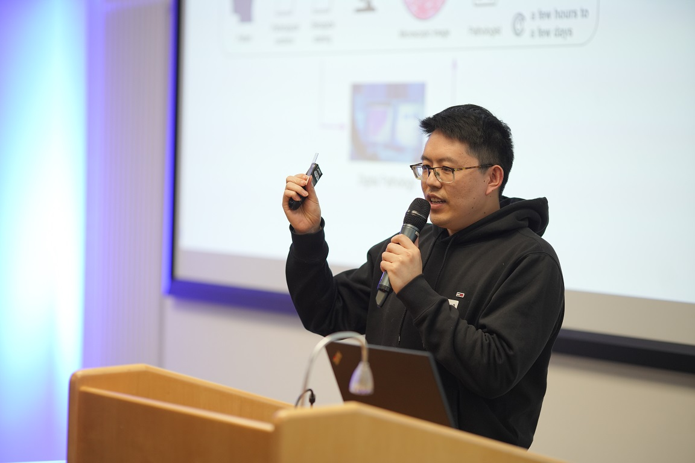
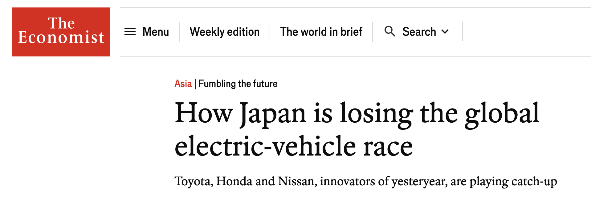

<!-- _class: title -->
# What I have learned for trying to be an entrepreneur

## Fei (Michael) Wang

> ### Research Assistant
> ### Economic Department
> Geothe University Frankfurt

> ### Co-Founder and 
> ### Machine Learning Engineer
> HyperGI 

---

# My Limited Entrepreneurial Experience

---

# Lesson No. 1: Reality is harsh

---

- ## It takes me around 5 months to have a team
- ## The team is not working cohesively
- ## We made some small money but not enough to support the team financially
- ## very hard to get funding from investors or government

---

# Innovation is very risky for all (startups, corporations, and governments)

---

---

# But reality should be harsh

Common questions I encountered:

> XXX firms are doing the same thing, why do you think you can do better?

> You are not the first one who has this idea, why do you think you can succeed?

> Who will pay for your product or service?

---

# Those questions are indeed legitimate!

- ## I will explain why those questions are legitimate
- ## I will use two real life examples to illustrate
    - ### Things I wish I knew before I started my startup
    - ### Things I wish I will stick to if I start another startup