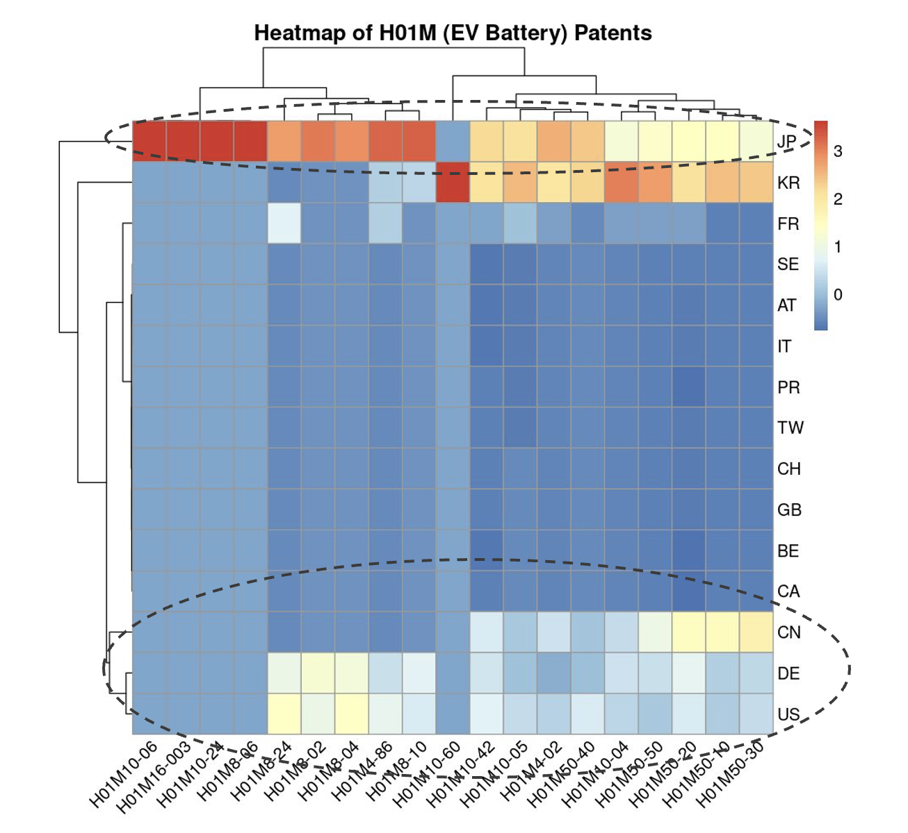
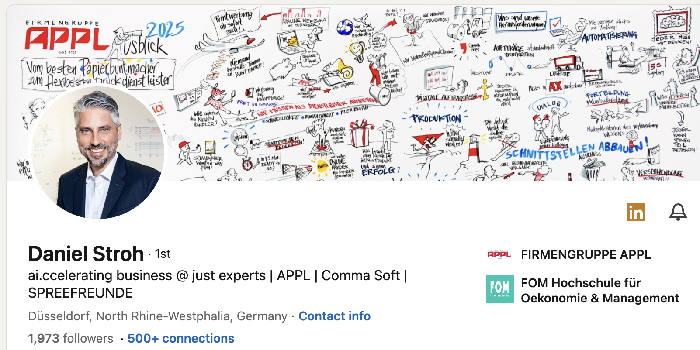
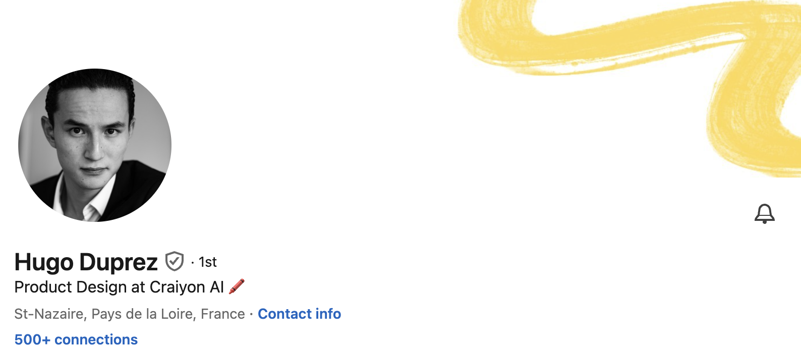

<!-- _class: title -->
# What I have learned for trying to be an entrepreneur

## Fei (Michael) Wang

> ### Research Assistant
> ### Economic Department
> Geothe University Frankfurt

> ### Co-Founder and 
> ### Machine Learning Engineer
> HyperGI 

---

# My Limited Entrepreneurial Experience

---

# Lesson No. 1: Reality is harsh

---

* ## It takes me around 5 months to have a team
* ## The team is not working cohesively
* ## We made some small money but not enough to support the team financially
* ## very hard to get funding from investors or government

---

# Innovation is very risky for all (startups, corporations, and governments)

---

---

---

# But reality should be harsh

Common questions I encountered:

* > XXX firms are doing the same thing, why do you think you can do better?

* > You are not the first one who has this idea, why do you think you can succeed?

* > Who will pay for your product or service?

---

# Those questions are indeed legitimate! 

* ## Why the reality should be and is harsh?
* ## I will explain why those questions are legitimate
* ## I will use two real life examples to illustrate
    * ### Things I wish I knew before I started my startup
    * ### Things I will stick to no matter what I do in the future

---

# Example 1: "Sell first, think later" - Daniel Stroh 

---

# Let's watch an animation to understand the concept

---

# Example 2: "Always offer huge value when you looking for attention" - Hugo Duprez 

---

# Hugo's story

* ## Pixelicious - founded and acquired
    * image processing for the game industry
* ## TextureLab - founded and acquired
    * AI-powered 3D texture generation

--- 

# Let's visit Hugo's website to learn what he has learned

- https://www.hugoduprez.com/about
